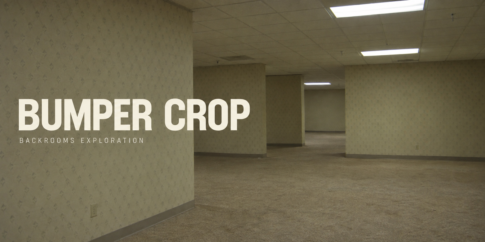
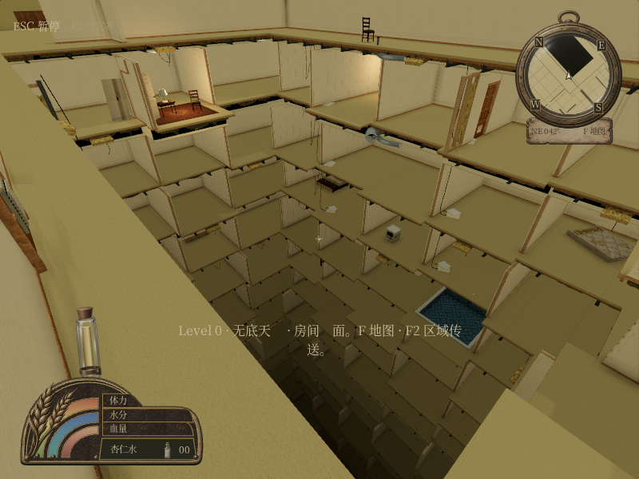

# Bumper Crop



一款还在慢慢搭建的后室探索游戏。

从阴天里的麦田出发，沿着泥泞车辙走过农舍、湖泊和营地。路会通向城市，也会把你带进没有尽头的米黄色房间。地图里的大多数地方很安静，偶尔能碰见正在吃饭、抽烟或烤火的人。

画面参考 PS1、早期 PS2 游戏和旧数码相机照片。建筑、家具、人物与贴图都在持续补充。目前可以探索 Level 10、Level 11、Level 0，以及地下温泉和水疗空间。

[在线试玩](https://level10-chlorine-0906.obtusecat.chatgpt.site)

## 游戏画面



上图是游戏开发过程中的实际截图。页首是生成的概念封面，不是游戏截图。

## 开发

使用 JavaScript 和 Three.js。游戏按固定种子生成地图，模型、贴图和运行库保存在本地资源目录中。

完整工程导入后，在工程根目录运行：

```bash
npm run dev -- --host 127.0.0.1 --port 4173
```

然后打开 http://127.0.0.1:4173 。需要 Node.js 20 或更高版本，不能直接双击 HTML 文件运行。

当前版本是 V98。仓库包含源码、美术源文件、资源处理脚本和开发历史。

## 接着做

开发说明写在 `AGENTS.md`，资源处理脚本在 `scripts/`，原始素材和处理记录在 `art-source/`。部分旧脚本使用以前的工作目录，换机器后需要调整路径。

请保留第三方库和素材的许可说明。整个项目的发布许可尚未单独指定。

